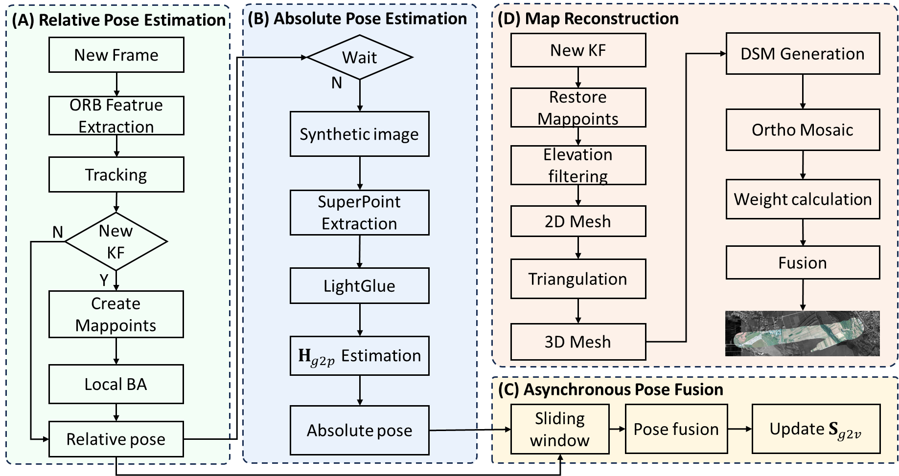

<div align="center">

# SatOrtho

### Satellite-Map-Prior-Assisted Real-Time Orthophoto Generation

Maoan Zhou · Yongfei Li · Min Kong · Jieyu Liu · Zhaoyun Luo · Dongfang Yang<sup>*</sup>

*Manuscript under review at IEEE Journal of Selected Topics in Applied Earth Observations and Remote Sensing (JSTARS)*

[](#citation)
[](#release-status)
[](#method)
[](#method)

[Overview](#overview) · [Framework](#framework) · [Method](#method) · [Release Status](#release-status) · [Citation](#citation)

</div>

---

## Overview

SatOrtho is a real-time UAV orthophoto generation framework for GNSS-denied
environments. Instead of relying on external positioning signals, it uses
prior satellite maps as globally referenced cues, aligns them with high-rate
visual SLAM poses, and incrementally constructs a georeferenced orthophoto
during flight.

> [!IMPORTANT]
> This repository is an initial partial release accompanying a manuscript
> under review. The complete implementation, datasets, and evaluation scripts
> will be released after acceptance.

## Framework

<p align="center">
  
</p>

<p align="center"><sub>
SatOrtho combines relative pose estimation, satellite-map-based absolute pose
estimation, asynchronous pose fusion, and incremental map reconstruction.
</sub></p>

## Method

SatOrtho is organized as four concurrently running modules connected through
asynchronous queues.

### 1. Relative Pose Estimation

Incoming UAV frames are processed by a visual SLAM front end. ORB features,
frame-to-frame tracking, keyframe selection, map-point creation, and local
bundle adjustment provide high-rate relative camera poses in the visual frame.

### 2. Absolute Pose Estimation

For each selected keyframe, SatOrtho renders a viewpoint-adapted satellite-map
patch and establishes cross-temporal, cross-view correspondences with
SuperPoint and LightGlue. The estimated geometric relation anchors the
keyframe directly in the geographic coordinate frame without GNSS or GCPs.

### 3. Asynchronous Relative-Absolute Pose Fusion

A sliding window estimates the similarity transformation between the visual
and geographic frames from matched keyframes. High-rate SLAM poses are
continuously transformed with the latest estimate, while newly available
absolute observations update the alignment without blocking visual tracking.

### 4. Incremental Orthophoto Reconstruction

New keyframes restore their visible map points, filter elevation outliers, and
form a triangulated surface for orthorectification. The resulting image regions
are inserted into the global mosaic, where view-angle-aware weights favor
near-nadir observations and progressively refine previously mapped areas.

## Repository Structure

```text
SatOrtho/
|-- framework.png       # System overview
|-- include/
|   |-- map/            # Mapping and pose-fusion interfaces
|   |-- spdlog/         # Logging support
|   |-- utils/          # Shared data structures and timing utilities
|   `-- zmq/            # Messaging interfaces
|-- src/
|   |-- map/            # Mapping and pose-fusion implementation
|   |-- spdlog/         # Logging implementation
|   `-- zmq/            # Messaging implementation
`-- test/               # Development and integration programs
```

## Release Status

| Component | Status |
|:--|:--|
| Mapping and asynchronous pose-fusion code | Available |
| Messaging and supporting interfaces | Available |
| `gis_data` implementation | Withheld from the current snapshot |
| Datasets and configuration files | Planned after acceptance |
| Build and evaluation scripts | Planned after acceptance |

Because required components are intentionally withheld, this snapshot is not
yet a standalone buildable release.

## Citation

```bibtex
@unpublished{zhou2026satortho,
  title  = {SatOrtho: Satellite-Map-Prior-Assisted Real-Time Orthophoto Generation},
  author = {Zhou, Maoan and Li, Yongfei and Kong, Min and Liu, Jieyu and Luo, Zhaoyun and Yang, Dongfang},
  note   = {Manuscript submitted to IEEE Journal of Selected Topics in Applied Earth Observations and Remote Sensing},
  year   = {2026}
}
```

## License

A license will be provided with the complete public release.
